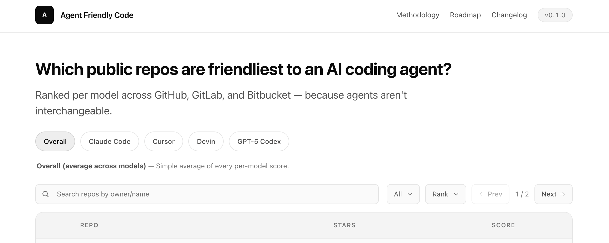
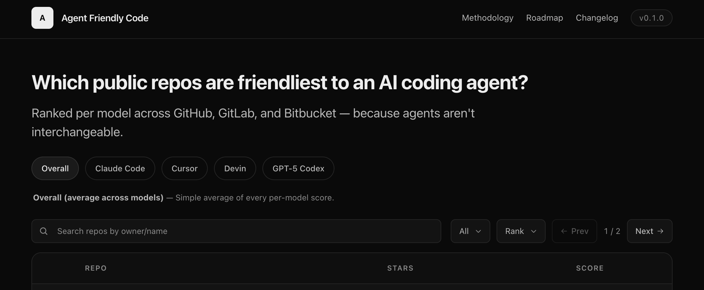

# Agent Friendly Code

[](./lib/changelog.ts)
[](./LICENSE)
[](https://nextjs.org)
[](https://nodejs.org)
[](https://github.com/sponsors/hsnice16)
[](https://www.agentfriendlycode.com)

**A public dashboard that ranks open-source repos by how friendly they are for AI coding agents — per model.**

Next.js 16 + SQLite (`better-sqlite3`), styled with Tailwind CSS 4. Spans GitHub, GitLab, and Bitbucket out of the box. Current release: **0.3.0**.



<details>
<summary>Dark mode</summary>



Follows `prefers-color-scheme` automatically — same tokens, different values.

</details>

---

## The idea

AI coding agents — Claude Code, Cursor, Devin, GPT-5 Codex, Gemini CLI, Aider, OpenHands, Pi — succeed dramatically more often on some repos than others. The difference is rarely the agent; it's the repo. A codebase with fast tests, a clear `AGENTS.md`, a Makefile, and CI is a massively different environment than one without.

**Goal**: a public leaderboard where anyone can look up a repo and see:

1. How agent-friendly is it overall?
2. How friendly is it for _my_ agent? (Claude Code weights `AGENTS.md` heavily; Devin cares about CI + reproducible envs; Cursor prefers strong types + a good README.)
3. _Why_ does it rank there, and **what would it take to improve for my agent?** — top-3 gaps ranked by score-gain.

Two audiences:

- **Maintainers** — a ranked checklist of what to fix to make their repo friendlier to agents.
- **Agent users** — when picking between forks, packages, or alternatives, agent-friendliness is a real dependency-choice signal.

## Prior art + what we do differently

| Project                                                                   | What it does                                                                                                      | What we do differently                                                                                                                                                                            |
| ------------------------------------------------------------------------- | ----------------------------------------------------------------------------------------------------------------- | ------------------------------------------------------------------------------------------------------------------------------------------------------------------------------------------------- |
| **Factory.ai Agent Readiness**                                            | Single-tenant scanner: you point it at your repo and get a score with auto-fix PRs. 8 pillars, 5 maturity levels. | **Public + cross-forge + per-model.** Factory rates your own repo in isolation — we rank _across_ repos, on GitHub/GitLab/Bitbucket, and the ranking changes based on which agent you care about. |
| **`kodustech/agent-readiness`**                                           | OSS alternative to Factory — static checks, local scan.                                                           | We're a public ranking service, not a local scanner. Scoring logic is similar in spirit; the product is the leaderboard and the per-model lens.                                                   |
| **`jpequegn/agent-readiness-score`**                                      | Explicitly "inspired by Factory.ai" — OSS framework to measure codebase readiness.                                | Same delta as above — single-tenant vs. public + per-model.                                                                                                                                       |
| **`viktor-silakov/ai-ready`**                                             | 39 checks, 7 pillars, 10+ languages. Scanner.                                                                     | Same delta.                                                                                                                                                                                       |
| **`ambient-code/agentready`**                                             | Assesses git repos against evidence-based attributes.                                                             | Same delta.                                                                                                                                                                                       |
| **Cloudflare Agent Readiness**                                            | Rates _websites_ for agent consumption.                                                                           | Wrong object — we rate code repos.                                                                                                                                                                |
| **Fern Agent Score**                                                      | Public leaderboard rating _documentation_ sites for AI-readiness.                                                 | Closest in shape — public + leaderboard — but scores docs, not code.                                                                                                                              |
| **Clarvia**                                                               | Scoring platform for _MCP servers_ (Agent Experience Optimization).                                               | Adjacent — rates tools, not repos.                                                                                                                                                                |
| **SWE-Bench (Verified / Pro), GitTaskBench, FeatureBench, HAL, PR Arena** | Rank _agents_ on a fixed set of repos.                                                                            | We want the **transpose**: rank repos _per agent_. Our measurement story (once the benchmark harness lands) looks a lot like these, with the axes flipped.                                        |
| **GitHub Trending, ossinsight**                                           | Popularity / activity rankings.                                                                                   | Stars ≠ agent-friendliness.                                                                                                                                                                       |

**Our differentiators, in one line**: cross-forge, public, **per-model**, and explainable — every score decomposes to signals, and every repo page shows _what to improve next_ for the selected model.

## Honest product concerns

Not pretending the idea is free of risk:

- **Per-model scoring is the hardest part and the easiest to fake.** Today the weights are illustrative. Real "Claude ranks this higher than GPT-5" requires actually running each agent on each repo. That's `tasks/1.0.0/03-benchmark-harness.md`.
- **Factory.ai is already in this space.** Differentiation has to stay sharp.
- **Public-shaming risk.** Ranking #47,823 without consent invites angry maintainers. Planned via `tasks/0.6.0/01-opt-out-claim-flow.md`.
- **Score gaming.** Once public, people add boilerplate `AGENTS.md` to pass the rubric without being useful. Dynamic (actually-run-an-agent) checks are the counter — see benchmark harness.
- **Freshness.** Scores decay with every push. Webhook-driven rescoring is roadmap.

See `/methodology` in the running app for a candid walkthrough of what's measured today and what isn't.

## Security posture (FAQ)

Short answer: **low risk**. The app:

- Only **reads** files after a shallow clone; never executes anything from the cloned tree (no `npm install`, no post-clone hooks).
- Uses `--depth 1 --single-branch` and never clones submodules.
- Runs all SQL via prepared statements.
- Renders through React (auto-escaping); the only `dangerouslySetInnerHTML` use is server-built JSON-LD with `<` escaped to `<`.
- Has no auth and no writable API endpoints — read-only dashboard.

**Operational concerns** for a public launch (not code-level security):

- Disk quotas for the clone workspace.
- Rate limiting the public API.
- Sandbox the cloner in a container (future-proofing against hypothetical git CVEs).

Auth and per-maintainer controls land with the opt-out / claim flow in v0.6.0.

## Quickstart

```bash
bun install
bun run prepare-hooks  # once — installs lefthook pre-commit (Biome + tsc + test + file-length)
bun run seed           # score the curated set across GH / GL / BB
bun run dev            # http://localhost:3000
```

Score a single repo:

```bash
bun run score https://github.com/vercel/next.js
bun run score https://gitlab.com/gitlab-org/cli
bun run score https://bitbucket.org/snakeyaml/snakeyaml
bun run score /path/to/local/checkout
```

Optional: `GITHUB_TOKEN` / `GITLAB_TOKEN` in env to raise API rate limits.

Run the unit tests with `bun run test` (uses `node --test` + `tsx`; requires Node ≥20.9.0).

## Versioning

`lib/version.ts` and `package.json` carry the current release number (currently **0.3.0**). Bumps happen only when we actually cut a release — never when merging intermediate work. The version pill in the header surfaces the number directly; `/changelog` lists what each release shipped.

## Stack & rationale

| Choice                                               | Why                                                                                                                                          | When we'd revisit                                                                                  |
| ---------------------------------------------------- | -------------------------------------------------------------------------------------------------------------------------------------------- | -------------------------------------------------------------------------------------------------- |
| **Next.js 16 (App Router)**                          | Future features (filters, charts, auth, diff views) are React's territory. File-based routing + API routes replace hand-rolled HTTP cleanly. | Unlikely. The core scorer is stack-agnostic, only `app/` depends on this.                          |
| **Node runtime (with `tsx` for CLI scripts)**        | Matches Vercel's serverless runtime — no Bun-only imports in prod. Bun still works locally as a fast package manager.                        | Unlikely — only if the deployment target changes.                                                  |
| **Tailwind CSS 4**                                   | Zero-config via `@theme` tokens, no `tailwind.config.*` needed. Tight bundle output.                                                         | Would only leave for something with a stronger design-system story.                                |
| **`better-sqlite3`**                                 | Single file, inspectable, zero ops overhead. Node-native so Vercel's serverless runtime can load it directly.                                | Postgres when concurrent writers / access control arrive (`tasks/1.0.0/01-postgres-migration.md`). |
| **Server-first; client islands where needed**        | Cheap, fast, SEO-friendly. Client components only where interactivity demands — mobile nav, search, selects, copy, back-to-top.              | When client islands grow past presentational interactivity → reach for client state mgmt.          |
| **Shallow git clones** (`--depth 1 --single-branch`) | Bandwidth + speed. Current signals don't need history.                                                                                       | History-aware signals → host APIs or `--filter=blob:none` partial clones.                          |
| **Exact-pinned deps**                                | Deterministic scoring across environments.                                                                                                   | Never.                                                                                             |
| **One file per signal**                              | Each signal is a small, independent concern — keeps `git log` and code review focused.                                                       | When we bundle signals into dynamic checks (then the unit becomes the bundle).                     |

## Why do we clone at all (instead of host APIs)?

- Static signals need to read **file contents** (AGENTS.md length, `pyproject.toml [tool.X]` sections, package.json scripts count) — not just existence.
- One clone is faster than N API calls for content-heavy scoring, and respects rate limits.
- Any real version of this dashboard needs dynamic signals (run tests, run an agent). Those absolutely need code on disk.

## Layout

```text
app/          Next.js App Router — pages + API + SEO
  layout.tsx       root layout, root metadata (OG + Twitter cards)
  page.tsx         leaderboard
  repo/[id]/       repo detail (includes generateMetadata for shareable titles)
  methodology/     how scoring works today
  roadmap/         upcoming versions (from lib/roadmap.ts)
  changelog/       what's shipped (from lib/changelog.ts)
  api/             repos + repo/[id] JSON routes
  robots.ts        /robots.txt — allows "/", blocks "/api/"
  sitemap.ts       /sitemap.xml — static routes + every repo
  globals.css      Tailwind import + @theme tokens
components/   React components (Tailwind-styled)
lib/
  scoring/    signals, weights, scorer — pure, no I/O outside the cloned tree
  clients/    git clone, host API
  constants/  thresholds, host labels, sort keys
  utils/      format + score-tier helpers
  db.ts       better-sqlite3 schema + queries (all SQL lives here)
  version.ts  APP_NAME, APP_VERSION, IS_PRE_RELEASE, APP_URL, APP_DESCRIPTION, REPO_URL
  changelog.ts / roadmap.ts
scripts/      CLI entries run via `tsx` (Node) — score, seed, init-db
tests/        `node --test` unit tests — scorer, signals, URL parser, formatters
tasks/        Per-version task breakdown (agent-readable)
public/       Static assets — demo/ screenshots used by the README + OG image
.claude/      settings.json, hooks/ (Stop guard), skills/
data/         rank.db (committed — shipped as a build artifact; rescoring runs locally)
AGENTS.md     Agent instructions (source of truth)
CONTRIBUTING.md  Human-contributor guide — PR workflow, review bar
CLAUDE.md     Pointer → AGENTS.md
LICENSE       MIT
```

## Roadmap (high-level)

See `/roadmap` in the running app or the per-version `tasks/` folders for the full picture.

Versions are sequenced cheap-first so the highest-impact small additions don't get gated on heavy infra:

- **0.4.0 — quick wins**: history-aware signals (maintenance recency, commit velocity, contributor activity) + a GitHub Action that comments the score delta on every PR + a Claude Code skill (with public `/api/score` lookup) that recommends a model for the active repo. No new infra.
- **0.5.0 — auto-refresh + smarter matching**: webhook-driven rescoring (keep scores fresh on every push) + alternatives via README embeddings (cross-language matches the v0.3.0 SQL heuristic misses).
- **0.6.0 — maintainer ownership + at-scale discovery**: OAuth opt-out / claim flow for maintainers + at-scale package overlay (per-registry leaderboards + userscript that renders the badge inline on npmjs.com / PyPI / crates.io).
- **1.0.0 — production cut**: Postgres migration for concurrent writers + auto-discovered crawl (target 10k repos) + benchmark harness that derives per-model weights from measured agent success. From here on, breaking API changes require a MAJOR bump.

## Defensibility

The score isn't defensible. The **evaluation harness + the cross-forge dataset + the maintainer network** are. Open-source the harness, publish the weights, keep the data + dashboard + badge network as the product.

## License

MIT — see [LICENSE](./LICENSE).

## Contributing

See [CONTRIBUTING.md](./CONTRIBUTING.md) for setup, branch/commit style, the PR description template, and the changelog discipline.

## Sponsor

If this project is useful to you, consider sponsoring its development: [github.com/sponsors/hsnice16](https://github.com/sponsors/hsnice16).
